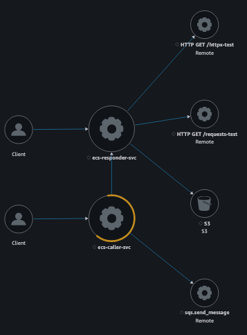

# ecs-internal-service

## 🚀 setup roles for ci

```sh
just tg dev aws/oidc apply
```

## 🚀 aws requirements

needs vpc named `vpc` with private and public subnets

## 🚀 usage

start locally with `docker compose up --build`

debug with `docker exec -it debug-tool /bin/sh`

can hit the app with `curl http://localhos6:3000/health`


## 🚀 local tunnel

needs `brew install --cask session-manager-plugin`

`just local-connect ecs-caller-svc`


## infra

### service module

Use of the shared service module. Contains ECS, networking and auto-scaling.

```hcl
module "service_consumer" {
  source = "../_shared/service"

  vpc_name   = var.vpc_name
  aws_region = var.aws_region

  state_bucket   = var.state_bucket
  environment    = var.environment
  container_port = var.container_port

  xray_enabled = var.xray_enabled
  local_tunnel = var.local_tunnel

  connection_type     = "internal"
  task_definition_arn = data.terraform_remote_state.task_consumer.outputs.task_definition_arn
  service_name        = data.terraform_remote_state.task_consumer.outputs.service_name

  desired_task_count = 1
}
```

#### networking

Served by the `connection_type` variable.

- `internal`: no ingress to ecs service
- `internal_dns`: only accessible via internal dns http
- `vpc_link`: accessible publicly via vpc link

##### xray

We can see traffic at an inter-service level in xray, as per below.



#### auto-scaling

Served by the `scaling_strategy` variable.

- `default`: no autoscaling policies and/or alarms

```hcl
scaling_strategy = {}
```

- `cpu`: scale based on CPU usage

```hcl
  scaling_strategy = {
    max_scaled_task_count = 4
    cpu = {
      scale_out_threshold  = 80  # Scale at 80% avg CPU
      scale_in_threshold   = 40  # Scale in below 40% avg  
      scale_out_adjustment = 1   # Add 2 tasks
      scale_in_adjustment  = 1   # Remove 1 task
      cooldown_out         = 180 # 3min cooldown
      cooldown_in          = 300 # 5min cooldown (anti-flap)
    }
  }
```

- `sqs`: scale based on average messages in a queue

```hcl
  scaling_strategy = {
    max_scaled_task_count = 4
    sqs = {
      scale_out_threshold  = 10  # Start scaling at 10 msgs avg
      scale_in_threshold   = 2   # Scale in below 2 msgs avg  
      scale_out_adjustment = 2   # Add 2 tasks at once
      scale_in_adjustment  = 1   # Remove 1 task
      cooldown_out         = 60 # 1min cooldown (more stable)
      cooldown_in          = 300 # 5min cooldown (prevent flapping)
      queue_name           = data.terraform_remote_state.sqs_consumer.outputs.sqs_queue_name
    }
  }
```

- `alb`: aws chooses how many tasks to add based on (average/minute) traffic. Max scaled tasks still respected.
```hcl
  scaling_strategy = {
    max_scaled_task_count = 4
    alb = optional(object({
      target_requests_per_task = number
      cooldown_in              = number
      cooldown_out             = number
    }))
  }
```

## debugging

- debug otel from within container
```sh
curl -X POST https://xray.eu-west-2.amazonaws.com/ -H "Content-Type: application/x-amz-json-1.1" -H "X-Amz-Target: AWSXRay_20160125.PutTraceSegments" -d '{"TraceSegmentDocuments":["{\"id\":\"1-5f84c7a8-869cd2224b6d8afd7a5d278f\",\"name\":\"my-service\",\"start_time\":1602611816.123,\"end_time\":1602611816.456}"]}' --max-time 3
```

- send sqs via caller svc
```sh
curl -X POST http://localhost:8000/send-to-sqs \
  -H "Content-Type: application/json" \
  -d '{
    "event": "test_event",
    "user_id": "12345",
    "data": "hello world"
  }'
```